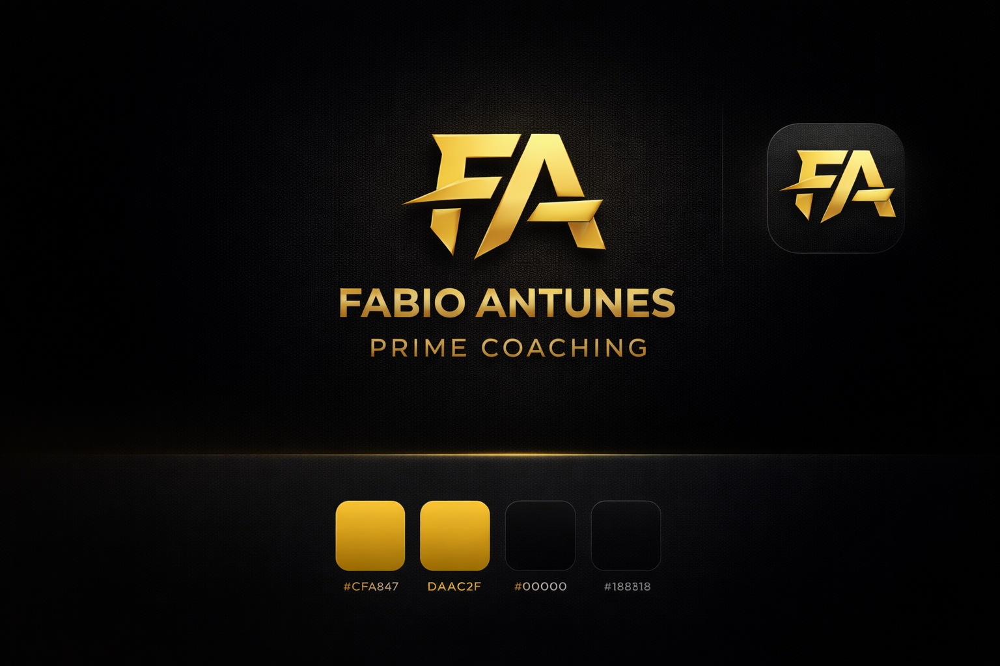

# Fabio Antunes — Prime Coaching · Prototyp

Erste Design-Vorschau im "Dark & Athletic / Premium Gold"-Stil.

## Ansehen

```bash
# Im Browser direkt öffnen:
open fabio-antunes-app/prototype/index.html

# Oder mit Live-Server (Auto-Reload):
cd fabio-antunes-app/prototype && python3 -m http.server 8080
# Dann http://localhost:8080 öffnen
```

Auf dem Handy: einfach die `index.html` im mobilen Browser öffnen, sieht in der Realität noch besser aus.

## Stand

- ✅ **Heute-Screen** (`index.html`) — Greeting, Workout-Hero, Tagesziele, Schnellzugriff, Coach-Chat-Preview, Bottom-Nav
- ⏳ Workout-Detail (kommt nach Freigabe)
- ⏳ Übungs-Tracking (kommt nach Freigabe)
- ⏳ Fortschritt mit Charts (kommt nach Freigabe)

## Design-Tokens

- **Akzent**: Gold `#DAAC2F` (mit `#F5C75A` als Highlight, `#CFA847` als Subtle)
- **Hintergrund**: Tiefschwarz `#0A0A0A` → Surface `#141414`
- **Typo**: Inter (300–800)

Alle Farben sind als CSS-Variablen in `assets/styles.css` definiert (oben unter `:root`).

## Logo austauschen

Aktuell ist ein **SVG-Platzhalter** in `assets/logo.svg`. So tauschst du dein PNG ein:

1. PNG (transparent, mind. 256×256) in `assets/logo.png` ablegen
2. In `index.html` ersetzen:
   ```html
   
   <!-- → -->
   
   ```
